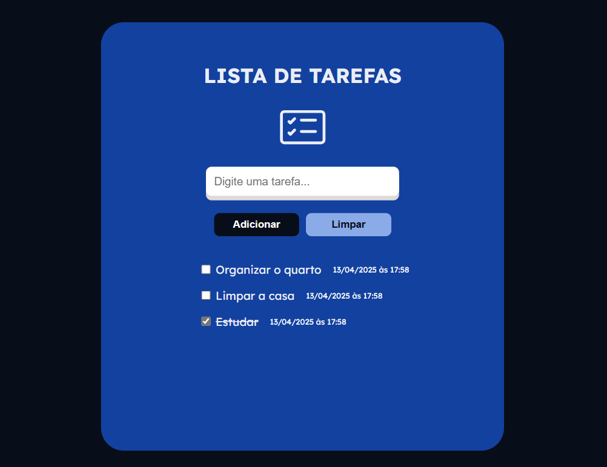

# Lista de Tarefas 
Esse projeto é a prova do meu aprendizado recente: uma lista de tarefas que eu construí sozinha, para praticar o que tenho estudado ultimamente. 
Contém criação de funções, manipulação de DOM, aprendi a criar elementos direto no JS, adicionei o registro de data e hora pra cada item e organizei tudo em módulos pra facilitar a manutenção.

## Como Funciona
- **Adicionar Tarefa**: Você pode adicionar uma nova tarefa à lista.
- **Registro de Data e Hora**: Cada tarefa adicionada é acompanhada da data e hora exata em que foi criada.
- **Marcar Como Concluída**: Você pode marcar uma tarefa como concluída, o que irá riscar o texto da tarefa.
- **Limpar Lista**: Ao clicar no botão "Limpar", todos os itens da lista serão removidos, e a mensagem de ausência de tarefas será exibida novamente.

## Estrutura do Projeto
**app.js**: Arquivo principal que gerencia a interação com os botões e exibe as mensagens de estado da lista. Ele importa a função `criandoLista()` do arquivo itensDaLista.js.

**itensDaLista.js**: Contém a função `criandoLista()`, responsável por criar dinamicamente os elementos HTML de cada item da lista (checkbox, texto da tarefa e data/hora). Ele também importa a função `criandoDataHora()` do arquivo dataCompleta.js.

**dataCompleta.js**: Contém a função `criandoDataHora()`, que gera a data e hora atual no formato brasileiro. Esta função é exportada para ser utilizada em outros módulos.

## Tecnologias Utilizadas
- JavaScript: Para a lógica de funcionamento do aplicativo.

- HTML/CSS: Para a estrutura e estilização da interface.

## Próximos Passos (Melhorias Futuras)
**Edição de Tarefas**: Adicionar funcionalidade para editar tarefas existentes.

**Remover Tarefa Individual**: Adicionar um botão para remover tarefas específicas da lista.

**Persistência de Dados**: Utilizar localStorage ou outra forma de armazenamento para que as tarefas não sejam perdidas ao fechar o navegador.

